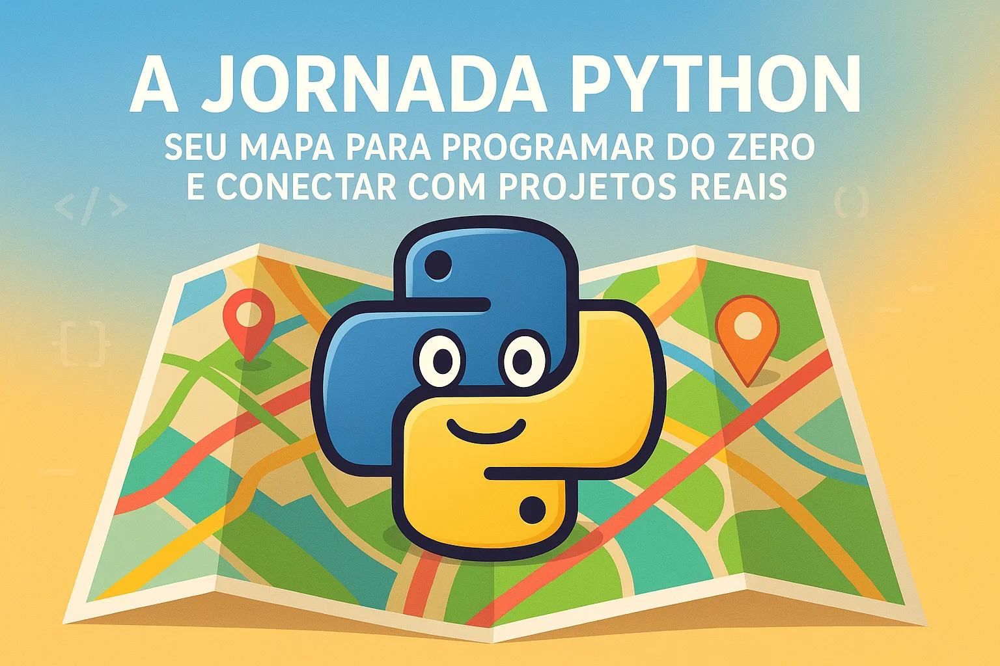

<p align="center">

</p>
# Sumário

* [Uma Palavra do Autor](#uma-palavra-do-autor)
* [Capítulo 1: O Que é Python e Por Que Ele?](#capítulo-1-o-que-é-python-e-por-que-ele)
* [Exemplo Prático do Capítulo 1](#exemplo-prático-do-capítulo-1-configuração-e-olá-mundo)
* [Capítulo 2: Variáveis e Tipos de Dados: Construindo o Básico](#capítulo-2-variáveis-e-tipos-de-dados-construindo-o-básico)
* [Capítulo 3: Operadores e Expressões: A Lógica por Trás do Código](#capítulo-3-operadores-e-expressões-a-lógica-por-trás-do-código)

# Uma Palavra do Autor

Olá! Meu nome é **João Eduardo**, e é uma alegria enorme compartilhar este "Mapa da Jornada Python" com você. Como desenvolvedor Python e programador há mais de 20 anos, vi de perto o poder transformador do código e a beleza dessa linguagem que tanto amo.

Este e-book, e todo o trabalho que faço, não seria possível sem o apoio incondicional das pessoas mais importantes na minha vida.

Quero expressar minha profunda gratidão à minha **família**, que sempre me incentivou e compreendeu as horas dedicadas a essa paixão. E, de coração, um agradecimento especial aos meus **três filhos** — vocês são a minha maior inspiração e a razão para buscar sempre mais, aprendendo e ensinando.

Espero que esta jornada seja tão gratificante para você quanto tem sido para mim.

Com carinho,

João Eduardo

---

# Capítulo 1: O Que é Python e Por Que Ele?

### Início da Sua Jornada Python!

Bem-vindo(a) ao mundo Python! Este e-book é seu **mapa** para aprender a programar do zero. Nosso objetivo é te dar a base que você precisa para criar seus próprios **projetos reais**, muitos deles no meu canal do YouTube. Vamos nessa!

### 1.1. O que é Python?

Python é uma **linguagem de programação simples e fácil de ler**, criada nos anos 90. Sua sintaxe lembra o inglês, o que a torna ótima para iniciantes.

É uma linguagem de **uso geral**, perfeita para:
* **Web:** Criar sites e APIs (Django, Flask).
* **Dados e IA:** Análise de dados, Machine Learning (Pandas, TensorFlow).
* **Automação:** Tornar tarefas repetitivas automáticas.
* E muito mais!

### 1.2. Por Que Python?

* **Fácil de Aprender:** Comece a programar rápido!
* **Versátil:** Usada em muitas áreas da tecnologia.
* **Comunidade Grande:** Muita ajuda e bibliotecas prontas.
* **Produtividade:** Faça mais com menos código.
* **Mercado:** Alta demanda por profissionais de Python.

### 1.3. Como Python Funciona?

Python é **interpretado**. Isso significa que um programa especial (o interpretador Python) lê e executa seu código linha por linha, sem precisar de compilação. Isso torna o desenvolvimento mais rápido.

### 1.4. Preparando o Ambiente

Você precisa do **Interpretador Python** e de um **Editor de Código**.

1.  **Instale Python:**
    * Vá em [python.org/downloads](https://www.python.org/downloads/).
    * **IMPORTANTE:** Marque "Add Python X.Y to PATH" durante a instalação.
    * Teste no terminal: `python --version` ou `python3 --version`.

2.  **Use um Editor:**
    * Sugiro o **Visual Studio Code (VS Code)**: [code.visualstudio.com](https://code.visualstudio.com/).
    * No VS Code, instale a extensão "Python" (da Microsoft) em `Ctrl+Shift+X`.

### 1.5. Seu Primeiro Programa: "Olá, Mundo!"

Vamos testar!

1.  No VS Code, crie um arquivo novo (`Ctrl+N`).
2.  Salve como `ola_mundo.py`.
3.  Digite esta linha de código:

    ```python
    print("Olá, Mundo!")
    ```

4.  Execute: Clique direito no arquivo e "Run Python File in Terminal", ou no terminal (`Ctrl+`) digite `python ola_mundo.py`.

Parabéns! Você rodou seu primeiro programa!

---

# Exemplo Prático do Capítulo 1: Configuração e "Olá, Mundo!"

```python
# ola_mundo.py

# Este é o seu primeiro programa em Python.
# A função 'print()' exibe texto na tela.
# O que está entre aspas será mostrado.

print("Olá, Mundo!")

# Experimente mudar a mensagem, por exemplo:
# print("Minha primeira linha de código em Python!")

# Como executar este arquivo:
# 1. Abra o terminal na pasta onde salvou o arquivo.
# 2. Digite: python ola_mundo.py
# 3. Pressione Enter.

```

# Capítulo 2: Variáveis e Tipos de Dados: Construindo o Básico

### Sua Caixa de Ferramentas de Dados

Imagine que você está organizando uma casa. Você precisa de caixas para guardar coisas diferentes. Em programação, essas "caixas" são as **variáveis**, e as "coisas" são os **dados**.

Neste capítulo, você aprenderá a guardar informações e os tipos básicos de dados que o Python reconhece. Isso é o alicerce para qualquer programa!

### 2.1. O Que São Variáveis?

Variáveis são como nomes para "locais" na memória do computador onde guardamos informações. O Python é esperto: ele descobre o "tipo" do dado que você está guardando sozinho.

**Regras Simples para Nomes de Variáveis:**
* Começam com letra ou `_`.
* Podem ter letras, números e `_`.
* Não podem ser palavras reservadas (ex: `if`, `for`).
* Prefira nomes claros (ex: `idade_usuario`).

**Criando uma Variável:**

```python
nome = "Alice"  # Guardando um texto
idade = 30      # Guardando um número
```

# Capítulo 3: Operadores e Expressões: A Lógica por Trás do Código

### Desvendando a Ação no Código

No Capítulo 2, aprendemos a guardar dados em variáveis. Agora, vamos ver como usar esses dados para tomar decisões e realizar cálculos. Para isso, precisamos de **operadores** e **expressões**. Eles são a "cola" que conecta suas variáveis e permite que seu programa seja dinâmico.

### 3.1. O Que São Operadores?

Operadores são símbolos especiais que realizam operações em valores e variáveis. Pense neles como as ações que você pode executar com seus dados.

Existem vários tipos:

* **Aritméticos:** Para cálculos matemáticos.
* **De Comparação:** Para comparar valores (resultam em `True` ou `False`).
* **Lógicos:** Para combinar condições (`True` ou `False`).
* **De Atribuição:** Para dar um valor a uma variável.

### 3.2. Operadores Aritméticos

Esses são os que você já conhece da matemática:

| Operador | Significado | Exemplo | Resultado |
| :------- | :----------- | :------ | :-------- |
| `+`      | Adição       | `5 + 3` | `8`       |
| `-`      | Subtração    | `10 - 4`| `6`       |
| `*`      | Multiplicação| `2 * 6` | `12`      |
| `/`      | Divisão      | `10 / 2`| `5.0`     |
| `//`     | Divisão Inteira | `10 // 3` | `3`       |
| `%`      | Módulo (Resto) | `10 % 3` | `1`       |
| `**`     | Potência     | `2 ** 3` | `8`       |

**Exemplo:**

```python
num1 = 15
num2 = 4
soma = num1 + num2      # 19
resto = num1 % num2     # 3 (porque 15 = 4*3 + 3)